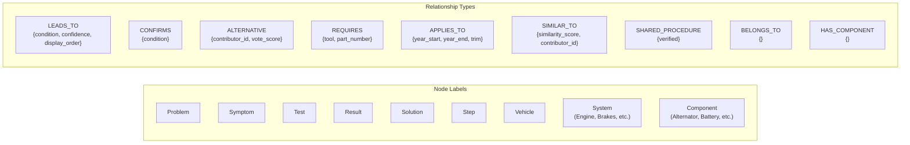
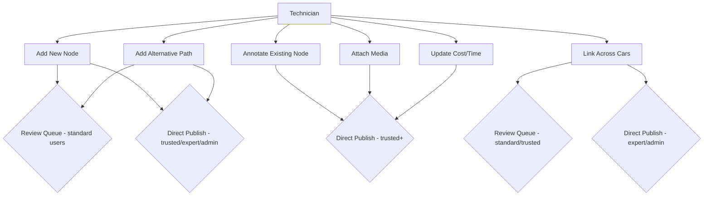
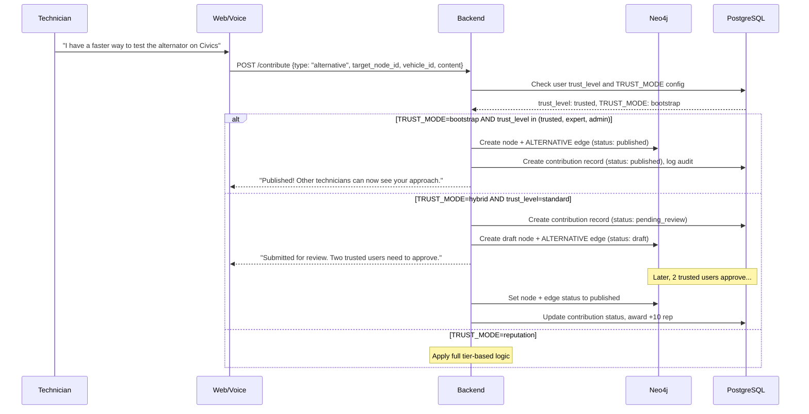
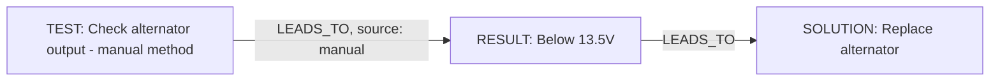
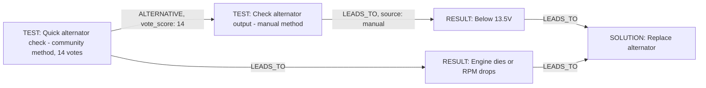
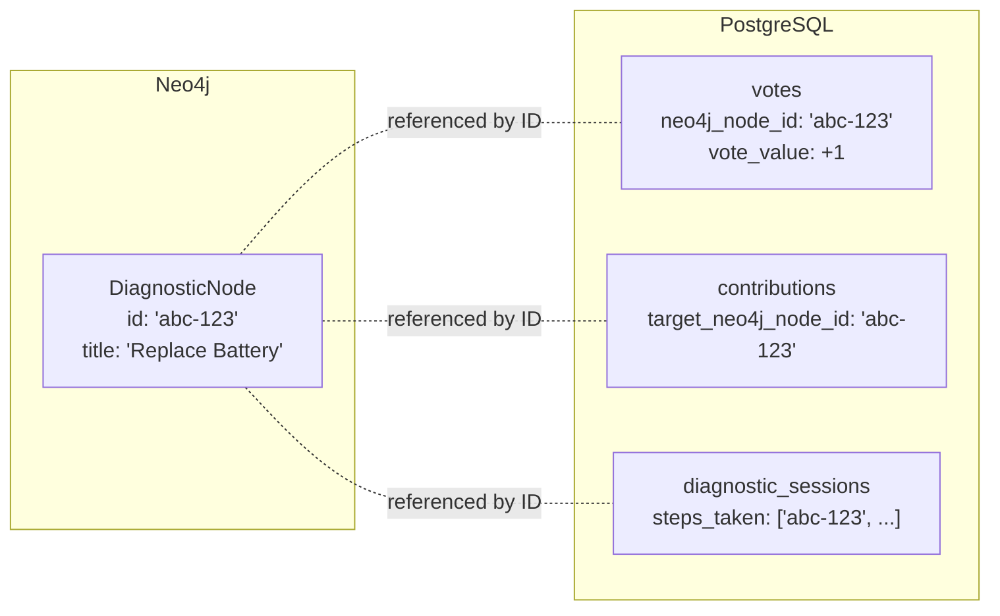
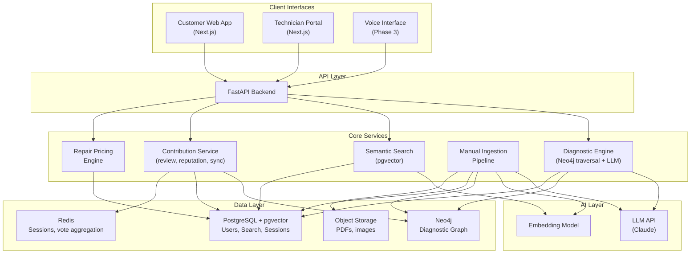
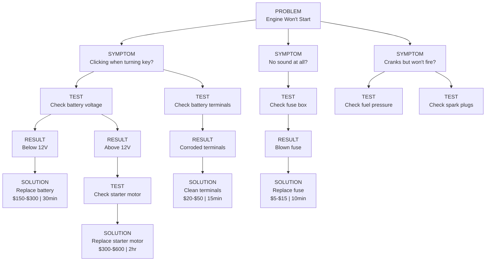
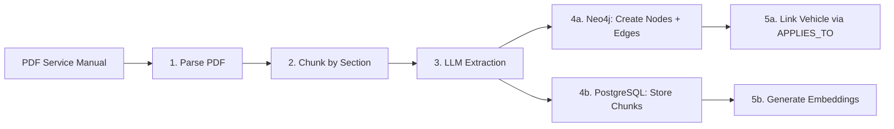
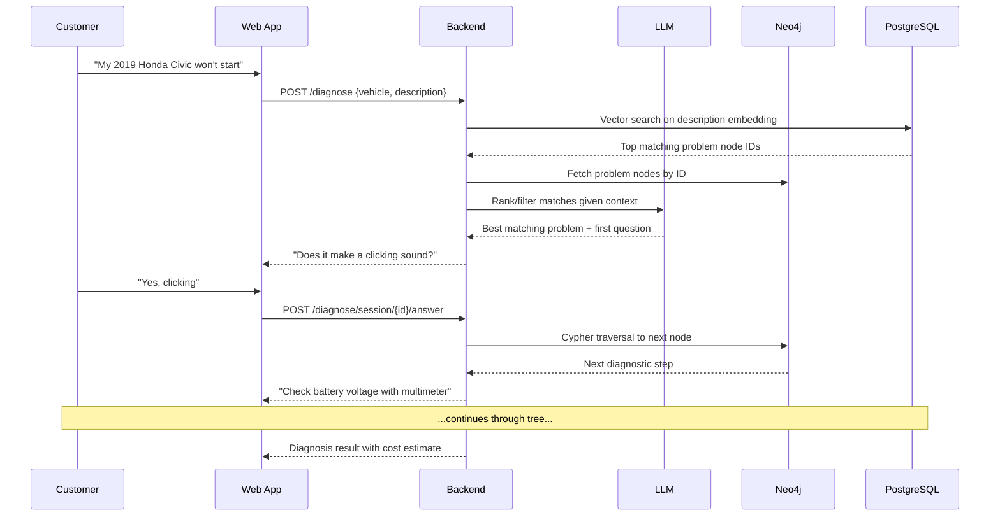

# Connected Diagnostics: System Architecture (v2)

## Revision Notes

v2 changes from v1:

- **Neo4j is now a foundational component**, not deferred. Cross-car knowledge sharing and rich graph traversal are core to the product.
- **Technician contribution system** is fully designed and built in Phase 1, not deferred to Phase 2.
- **Dual-database architecture**: Neo4j owns the diagnostic graph, PostgreSQL + pgvector owns relational data and semantic search.

---

## Why Two Databases: Neo4j + PostgreSQL

Each database does what it's best at:

**Neo4j (graph database) owns:**

- The entire diagnostic tree (nodes and edges)
- Cross-car relationships ("this alternator replacement procedure is the same across all 2018-2022 Honda Civics")
- "SIMILAR_TO" links between procedures across different vehicles
- "SHARED_PROCEDURE" links where identical steps apply to multiple cars
- Graph traversal queries ("walk me from problem -> diagnosis in 3 hops")
- Relationship-heavy queries ("what other cars have this exact same issue?")

**PostgreSQL + pgvector owns:**

- Users, authentication, reputation scores
- Manual chunks with vector embeddings (for semantic search / RAG)
- Diagnostic session logs (relational with JSONB)
- Pricing data (parts costs, labor rates, regional data)
- Contribution audit trail
- Vote records

**Why not just Neo4j for everything?** Neo4j is poor at full-text/vector similarity search, user authentication patterns, and transactional writes like voting tallies. **Why not just PostgreSQL?** Recursive CTEs for graph traversal get unwieldy fast once you need cross-car links, weighted path scoring, and variable-depth traversal. When a tech says "this fix also works on Accords," that's a `SIMILAR_TO` edge in Neo4j -- trivial. In SQL, it's a mess of junction tables.

---

## Neo4j Graph Schema




**Cypher example -- a diagnostic node and its cross-car links:**

```cypher
// Create a problem node
CREATE (p:Problem {
  id: randomUUID(),
  title: "Engine Won't Start",
  description: "Vehicle fails to start when ignition is turned",
  source_type: "manual",
  source_ref: "Honda Civic 2019 Service Manual p.412",
  created_at: datetime(),
  vote_score: 0
})

// Link it to a vehicle
MATCH (p:Problem {title: "Engine Won't Start"})
MATCH (v:Vehicle {make: "Honda", model: "Civic", year: 2019})
CREATE (p)-[:APPLIES_TO {year_start: 2016, year_end: 2021}]->(v)

// Link a shared procedure across cars
MATCH (sol1:Solution {title: "Replace Battery"})
MATCH (sol2:Solution {title: "Replace Battery - Accord"})
CREATE (sol1)-[:SHARED_PROCEDURE {verified: true}]->(sol2)

// Traversal: walk a diagnostic path
MATCH path = (p:Problem {title: "Engine Won't Start"})
  -[:LEADS_TO*1..6]->(sol:Solution)
WHERE ALL(r IN relationships(path) WHERE r.vehicle_id IS NULL
  OR r.vehicle_id = $vehicleId)
RETURN path
ORDER BY reduce(s = 0, r IN relationships(path) | s + coalesce(r.vote_score, 0)) DESC
```

**Key graph design decisions:**

- **Vehicle is a node, not a property.** This lets you query "show me all problems that affect both Civic and Accord" as a graph pattern match, not a table join.
- **System and Component are separate node types.** A Vehicle HAS_COMPONENT Battery. Battery BELONGS_TO Electrical System. This creates a taxonomy you can traverse: "show me all electrical problems for this car."
- **ALTERNATIVE edges are the contribution mechanism.** When a tech says "there's a better way to do this step," that creates an ALTERNATIVE edge from the existing node to a new node. The original manual path stays intact; the community path lives alongside it.
- **SIMILAR_TO and SHARED_PROCEDURE** are the cross-car magic. SIMILAR_TO is soft ("these are related"), SHARED_PROCEDURE is hard ("these are literally the same procedure").

---

## Technician Contribution System

This is the engine that makes the knowledge base grow. The model is inspired by Stack Overflow's reputation system but adapted for diagnostic knowledge.

### Bootstrap-Friendly Trust Model

The trust model adapts to the size of the active community. A config flag `TRUST_MODE` (`bootstrap`, `hybrid`, or `reputation`) controls which phase is active. Transitions between phases are a config change, not a schema migration.

#### Phase A: Bootstrap Mode (fewer than ~50 active technicians)

- The admin manually invites the first 10-20 technicians. Invited users get **Trusted** status immediately -- no earning required.
- Trusted users can contribute directly (no review queue). All contributions are visible to all other Trusted users.
- Any Trusted user can flag a contribution as questionable. Flags go to the admin.
- Voting still happens, but it ranks content rather than gating publish.
- The admin can revoke Trusted status if someone contributes garbage.
- This is a **high-trust small team** model -- like a shared Google Doc among colleagues.

#### Phase B: Hybrid Mode (50-500 active technicians)

- New signups who are NOT invited start as **Standard** users.
- Standard users' contributions go through lightweight review: any 2 Trusted users approve = published.
- Trusted users still publish directly.
- Reputation points start accumulating for everyone, but thresholds are low: 20 rep to become Trusted (achievable in a week of active use).
- The admin can still manually grant Trusted status (e.g., a known master tech joins).

#### Phase C: Full Reputation Mode (500+ active technicians)

- The full 4-tier system activates with adjusted thresholds.
- All existing Trusted users get their accumulated rep mapped to the appropriate tier.
- Review queue is now staffed by hundreds of Tier 2+ users -- it works at scale.

```
Trust Levels:
  standard  - Default for new signups (non-invited)
  trusted   - Invited users (bootstrap) or earned via reputation (hybrid/full)
  expert    - Earned at 500+ rep (full mode) or admin-granted
  admin     - Platform administrators

Trust Sources:
  invited       - Admin invited this user (gets trusted immediately)
  earned        - Reputation threshold crossed automatically
  admin_granted - Admin manually promoted this user

Reputation is earned:
  +10  Contribution approved by reviewer
  +5   Contribution upvoted
  +15  Your alternative path is chosen by a user completing diagnosis
  +25  You create a cross-car link that gets verified
  -2   Contribution downvoted
  -10  Contribution rejected by reviewer
```

#### Why This Works at 10 Users

- Day 1: You invite 10 techs. They all have Trusted status.
- Day 2: They start adding knowledge. No queue. No waiting. No friction.
- Week 2: You see who's active, who contributes good stuff. The knowledge base is growing.
- Month 3: Word spreads. New techs sign up organically. They start in Standard tier. Your original 10 review their stuff.
- Month 6+: You have 100+ users. Switch to hybrid mode. Reputation matters more.
- Year 1: Full reputation system online.

### Contribution Types




### How a Contribution Flows



The contribution routing logic in pseudocode:

```
Contribution arrives:
  if TRUST_MODE == bootstrap:
    if user.trust_level in (trusted, expert, admin): publish directly
    else: reject (bootstrap mode is invite-only)
  elif TRUST_MODE == hybrid:
    if user.trust_level in (trusted, expert, admin): publish directly
    else: send to review (need 2 trusted approvals)
  elif TRUST_MODE == reputation:
    apply full tier-based logic (standard thresholds)
```


### What the Contribution Looks Like in the Graph

Before a technician contributes:



After a technician adds an alternative:




The ALTERNATIVE edge connects the community-contributed test to the original manual test. Users see both options, ranked by vote score. The manual path is always preserved as the "official" baseline.

---

## PostgreSQL Schema (Relational + Vector)

PostgreSQL handles everything that isn't the diagnostic graph itself:

```sql
-- Users and reputation
CREATE TABLE users (
    id UUID PRIMARY KEY DEFAULT gen_random_uuid(),
    email TEXT UNIQUE NOT NULL,
    display_name TEXT NOT NULL,
    user_type TEXT NOT NULL CHECK (user_type IN ('customer', 'technician', 'admin')),
    reputation INT DEFAULT 0,
    trust_level TEXT NOT NULL DEFAULT 'standard'
        CHECK (trust_level IN ('standard', 'trusted', 'expert', 'admin')),
    trust_source TEXT NOT NULL DEFAULT 'earned'
        CHECK (trust_source IN ('invited', 'earned', 'admin_granted')),
    specializations JSONB DEFAULT '[]',
    created_at TIMESTAMPTZ DEFAULT now()
);

-- Manual chunks for RAG / semantic search
CREATE TABLE manual_chunks (
    id UUID PRIMARY KEY DEFAULT gen_random_uuid(),
    vehicle_neo4j_id TEXT NOT NULL,       -- references Neo4j Vehicle node
    source_file TEXT NOT NULL,
    page_number INT,
    chunk_text TEXT NOT NULL,
    chunk_type TEXT NOT NULL,              -- procedure, diagram, parts_list, spec, warning
    embedding vector(1536),
    metadata JSONB DEFAULT '{}',
    created_at TIMESTAMPTZ DEFAULT now()
);
CREATE INDEX ON manual_chunks USING ivfflat (embedding vector_cosine_ops) WITH (lists = 100);

-- Contributions audit trail
CREATE TABLE contributions (
    id UUID PRIMARY KEY DEFAULT gen_random_uuid(),
    user_id UUID REFERENCES users(id),
    contribution_type TEXT NOT NULL,       -- new_node, alternative, annotation, attachment, cross_car_link, cost_update
    target_neo4j_node_id TEXT,            -- the node being modified/extended
    created_neo4j_node_id TEXT,           -- the new node created (if any)
    content JSONB NOT NULL,               -- full contribution payload
    status TEXT DEFAULT 'pending_review',  -- pending_review, published, rejected, superseded
    reviewed_by UUID REFERENCES users(id),
    reviewed_at TIMESTAMPTZ,
    review_notes TEXT,
    created_at TIMESTAMPTZ DEFAULT now()
);

-- Votes on Neo4j nodes (referenced by neo4j ID)
CREATE TABLE votes (
    id UUID PRIMARY KEY DEFAULT gen_random_uuid(),
    user_id UUID REFERENCES users(id),
    neo4j_node_id TEXT NOT NULL,
    vote_value INT NOT NULL CHECK (vote_value IN (-1, 1)),
    created_at TIMESTAMPTZ DEFAULT now(),
    UNIQUE(user_id, neo4j_node_id)
);

-- Diagnostic sessions
CREATE TABLE diagnostic_sessions (
    id UUID PRIMARY KEY DEFAULT gen_random_uuid(),
    user_id UUID REFERENCES users(id),
    vehicle_neo4j_id TEXT NOT NULL,
    starting_problem_neo4j_id TEXT NOT NULL,
    steps_taken JSONB DEFAULT '[]',       -- [{node_id, answer, timestamp}, ...]
    final_diagnosis_neo4j_id TEXT,
    chosen_path_neo4j_ids TEXT[],         -- ordered list of node IDs in the path taken
    status TEXT DEFAULT 'in_progress',
    created_at TIMESTAMPTZ DEFAULT now(),
    completed_at TIMESTAMPTZ
);

-- Pricing data (crowdsourced + manual)
CREATE TABLE pricing_data (
    id UUID PRIMARY KEY DEFAULT gen_random_uuid(),
    neo4j_solution_id TEXT NOT NULL,
    vehicle_neo4j_id TEXT,
    region TEXT,                           -- zip code prefix or metro area
    parts_cost_low DECIMAL,
    parts_cost_high DECIMAL,
    labor_cost_low DECIMAL,
    labor_cost_high DECIMAL,
    labor_hours_est DECIMAL,
    source TEXT NOT NULL,                  -- manual, technician, aggregated
    reported_by UUID REFERENCES users(id),
    reported_at TIMESTAMPTZ DEFAULT now()
);
```

---

## Dual-Database Sync Pattern

The two databases reference each other by Neo4j node IDs stored as text fields in PostgreSQL. This is intentionally loose coupling.




**Vote score sync:** When a vote is cast in PostgreSQL, a background task aggregates the score and writes it back to the Neo4j node's `vote_score` property. This is eventually consistent (seconds, not minutes) and avoids Neo4j write contention.

---

## Updated Architecture




---

## How the Diagnostic Decision Tree Works

Example tree for "Engine Won't Start" (unchanged from v1, but now natively stored as Neo4j graph):




The customer walks through this interactively. The LLM helps interpret natural language ("it makes a clicking noise") into the right symptom branch. Neo4j handles the traversal natively with Cypher.

---

## PDF Manual Ingestion Pipeline

Ingestion now writes to both databases:




---

## Customer-Facing MVP Flow (unchanged)




---

## Tech Stack (updated)

- **Frontend**: Next.js 14 + TypeScript + Tailwind
- **Backend**: Python + FastAPI
- **Graph Database**: Neo4j 5 (diagnostic tree, cross-car relationships)
- **Relational + Vector DB**: PostgreSQL 16 + pgvector (users, sessions, search, pricing)
- **Cache**: Redis (session state, vote aggregation buffer)
- **Object Storage**: S3 or MinIO (PDFs, images, schematics)
- **AI - LLM**: Claude API (Anthropic)
- **AI - Embeddings**: OpenAI text-embedding-3-small (1536 dims)
- **Deployment**: Docker Compose (dev), AWS ECS or Railway (prod)

---

## Project Structure (updated)

```
connected-diagnostics/
├── backend/
│   ├── app/
│   │   ├── main.py
│   │   ├── api/routes/
│   │   │   ├── diagnose.py          # Customer diagnostic flow
│   │   │   ├── contribute.py        # Technician contributions
│   │   │   ├── vehicles.py          # Vehicle CRUD
│   │   │   ├── nodes.py             # Diagnostic node browsing
│   │   │   ├── search.py            # Semantic search
│   │   │   ├── review.py            # Contribution review queue
│   │   │   └── auth.py              # Registration, login
│   │   ├── core/
│   │   │   ├── config.py
│   │   │   └── security.py
│   │   ├── db/
│   │   │   ├── neo4j_client.py      # Neo4j connection + helpers
│   │   │   ├── postgres.py          # SQLAlchemy async engine
│   │   │   └── redis_client.py      # Redis connection
│   │   ├── models/                  # SQLAlchemy models (PostgreSQL)
│   │   │   ├── user.py
│   │   │   ├── manual_chunk.py
│   │   │   ├── contribution.py
│   │   │   ├── vote.py
│   │   │   ├── session.py
│   │   │   └── pricing.py
│   │   ├── graph/                   # Neo4j graph operations
│   │   │   ├── schema.py            # Cypher for constraints/indexes
│   │   │   ├── queries.py           # Reusable Cypher query templates
│   │   │   ├── traversal.py         # Diagnostic path traversal logic
│   │   │   └── mutations.py         # Node/edge creation and updates
│   │   ├── services/
│   │   │   ├── diagnostic_engine.py # Orchestrates Neo4j + LLM
│   │   │   ├── search_service.py    # pgvector similarity search
│   │   │   ├── contribution_service.py  # Contribution + reputation logic
│   │   │   ├── review_service.py    # Review queue management
│   │   │   ├── pricing_service.py   # Cost estimation
│   │   │   ├── sync_service.py      # Neo4j <-> PostgreSQL sync (votes, etc.)
│   │   │   └── llm_service.py       # LLM integration
│   │   └── ingestion/
│   │       ├── pdf_parser.py
│   │       ├── chunk_processor.py
│   │       ├── llm_extractor.py
│   │       └── graph_builder.py     # Creates Neo4j nodes from extracted data
│   ├── alembic/
│   ├── tests/
│   ├── pyproject.toml
│   └── Dockerfile
├── frontend/
│   ├── app/
│   │   ├── page.tsx                 # Landing page
│   │   ├── diagnose/                # Customer flow
│   │   ├── contribute/              # Technician contribution UI
│   │   ├── review/                  # Review queue (Tier 2+)
│   │   └── browse/                  # Browse the diagnostic tree
│   ├── components/
│   │   ├── DiagnosticChat.tsx
│   │   ├── TreeBrowser.tsx          # Visual tree navigator
│   │   ├── ContributionForm.tsx     # Submit new knowledge
│   │   ├── ReviewCard.tsx           # Review pending contributions
│   │   ├── ReputationBadge.tsx
│   │   └── PriceEstimate.tsx
│   └── package.json
├── docker-compose.yml               # Neo4j + PostgreSQL + Redis + apps
└── README.md
```

---

## Phased Roadmap (revised)

### Phase 1: Foundation + Dual MVP (Weeks 1-8)

- Set up Neo4j + PostgreSQL + pgvector + Redis via Docker Compose
- Build PDF ingestion pipeline (your car's service manual)
- Create diagnostic graph from extracted content
- Build customer web app (diagnostic chat flow)
- Build basic technician contribution interface (add nodes, alternatives, annotations)
- Implement reputation system and review queue
- Basic cost estimation

### Phase 2: Growth + Multi-Car (Weeks 9-14)

- Ingest additional vehicle manuals
- Cross-car linking (SIMILAR_TO, SHARED_PROCEDURE)
- OBD-II error code database integration
- Enhanced technician dashboard (stats, contribution history)
- Pricing crowdsourcing from technicians

### Phase 3: Voice Interface (Weeks 15-20)

- Deepgram STT + ElevenLabs TTS integration
- Conversational state machine over the Neo4j graph
- Hands-free diagnostic guidance
- Lapel mic hardware integration

### Phase 4: Scale + Intelligence (Weeks 21+)

- Auto-suggest cross-car links from embedding similarity
- ML-based path ranking (which diagnostic path resolves fastest)
- Mobile app for in-shop use
- API for third-party integrations (shop management software)

---

## Key Architectural Decisions

1. **Neo4j from day one.** Cross-car knowledge sharing is the moat. Building it on SQL and migrating later would mean rewriting every query, every API contract, and every traversal algorithm. Neo4j's Cypher makes graph patterns trivial: `MATCH (p:Problem)-[:APPLIES_TO]->(v1:Vehicle), (p)-[:APPLIES_TO]->(v2:Vehicle) WHERE v1.make = 'Honda' AND v2.make = 'Toyota' RETURN p` -- try that in SQL.
2. **Bootstrap-friendly trust model (3-phase).** A pure reputation system doesn't work when you have 10 technicians -- nobody has enough rep to review anyone else, and everything stalls. Instead, the system starts in *bootstrap mode* where invited technicians publish directly (high trust, low friction). As the team grows to ~50+, it transitions to *hybrid mode* with lightweight reviews for new users and lower thresholds. Only at scale (500+ contributors) does the full reputation-tier system activate. The `TRUST_MODE` config (`bootstrap | hybrid | reputation`) controls routing without code changes. This prevents the cold-start problem while preserving the path to full community governance.
3. **ALTERNATIVE edges, not overwrites.** Technician knowledge never replaces manual knowledge -- it lives alongside it as a parallel path. This preserves the authoritative baseline while letting community wisdom surface through voting. A customer sees "Manual method: X (verified) | Community shortcut: Y (+14 votes)".
4. **Loose coupling between databases.** PostgreSQL references Neo4j by string IDs, not foreign keys. This means either database can be replaced, scaled, or rebuilt independently. The sync service handles vote score propagation as an async background task.
5. **Embeddings in PostgreSQL, graph in Neo4j.** Semantic search ("my car shakes at highway speed") hits pgvector to find relevant problem node IDs. Those IDs then feed into Neo4j traversal. This separation means each database handles the queries it's optimized for.

