# Connected Diagnostics: System Architecture (v2)

## Revision Notes

v3 changes from v2:

- **Multi-modal DTC input**: Users can type codes, upload photos of scan tool screens, or upload PDF diagnostic reports. Claude Vision extracts codes from images. A DTC correlation engine groups related codes into root-cause clusters before diagnosis begins.
- **Session lifecycle redesign**: Replaced flat `steps_taken JSONB` with normalized tables (`session_steps`, `session_estimates`, `session_decisions`, `session_repair_steps`, `session_links`). Sessions now track full lifecycle phases (diagnosis -> estimate -> decision -> repair -> verification -> completed). Cascading problems are handled via linked parent/child sessions.
- **OBD-II dongle moved to Phase 3+**: Live dongle/app integration is impractical for MVP. Text/image/PDF input covers the realistic use case.

v2 changes from v1:

- **Neo4j is now a foundational component**, not deferred. Cross-car knowledge sharing and rich graph traversal are core to the product.
- **Technician contribution system** is fully designed and built in Phase 1, not deferred to Phase 2.
- **Dual-database architecture**: Neo4j owns the diagnostic graph, PostgreSQL + pgvector owns relational data and semantic search.

---

## Why Two Databases: Neo4j + PostgreSQL

Each database does what it's best at:

**Neo4j (graph database) owns:**

- The entire diagnostic tree (nodes and edges)
- Cross-car relationships ("this alternator replacement procedure is the same across all 2018-2022 Honda Civics")
- "SIMILAR_TO" links between procedures across different vehicles
- "SHARED_PROCEDURE" links where identical steps apply to multiple cars
- Graph traversal queries ("walk me from problem -> diagnosis in 3 hops")
- Relationship-heavy queries ("what other cars have this exact same issue?")

**PostgreSQL + pgvector owns:**

- Users, authentication, reputation scores
- Manual chunks with vector embeddings (for semantic search / RAG)
- Diagnostic session logs (relational with JSONB)
- Pricing data (parts costs, labor rates, regional data)
- Contribution audit trail
- Vote records

**Why not just Neo4j for everything?** Neo4j is poor at full-text/vector similarity search, user authentication patterns, and transactional writes like voting tallies. **Why not just PostgreSQL?** Recursive CTEs for graph traversal get unwieldy fast once you need cross-car links, weighted path scoring, and variable-depth traversal. When a tech says "this fix also works on Accords," that's a `SIMILAR_TO` edge in Neo4j -- trivial. In SQL, it's a mess of junction tables.

---

## Neo4j Graph Schema

```mermaid
graph LR
    subgraph nodeLabels [Node Labels]
        Problem["Problem"]
        Symptom["Symptom"]
        TestNode["Test"]
        Result["Result"]
        Solution["Solution"]
        Step["Step"]
        Part["Part"]
        Tool["Tool"]
        Vehicle["Vehicle"]
        SystemNode["System<br/>(Engine, Brakes, etc.)"]
        Component["Component<br/>(Alternator, Battery, etc.)"]
    end

    subgraph relTypes [Relationship Types]
        R1["LEADS_TO<br/>{condition, confidence, display_order}"]
        R2["CONFIRMS<br/>{condition}"]
        R3["ALTERNATIVE<br/>{contributor_id, vote_score}"]
        R4["REQUIRES_PART<br/>{quantity, optional}"]
        R5["APPLIES_TO<br/>{year_start, year_end, trim}"]
        R6["SIMILAR_TO<br/>{similarity_score, contributor_id}"]
        R7["SHARED_PROCEDURE<br/>{verified}"]
        R8["BELONGS_TO<br/>{}"]
        R9["HAS_COMPONENT<br/>{}"]
        R10["REQUIRES_TOOL<br/>{optional}"]
        R11["NEXT_STEP<br/>{step_order}"]
        R12["RESOLVES<br/>{}"]
        R13["FITS<br/>{year_start, year_end, trim, notes}"]
        R14["SUBSTITUTES<br/>{direction, notes}"]
    end
```


**Cypher example -- a diagnostic node and its cross-car links:**

```cypher
// Create a problem node
CREATE (p:Problem {
  id: randomUUID(),
  title: "Engine Won't Start",
  description: "Vehicle fails to start when ignition is turned",
  source_type: "manual",
  source_ref: "Honda Civic 2019 Service Manual p.412",
  created_at: datetime(),
  vote_score: 0
})

// Link it to a vehicle
MATCH (p:Problem {title: "Engine Won't Start"})
MATCH (v:Vehicle {make: "Honda", model: "Civic", year: 2019})
CREATE (p)-[:APPLIES_TO {year_start: 2016, year_end: 2021}]->(v)

// Link a shared procedure across cars
MATCH (sol1:Solution {title: "Replace Battery"})
MATCH (sol2:Solution {title: "Replace Battery - Accord"})
CREATE (sol1)-[:SHARED_PROCEDURE {verified: true}]->(sol2)

// Traversal: walk a diagnostic path
MATCH path = (p:Problem {title: "Engine Won't Start"})
  -[:LEADS_TO*1..6]->(sol:Solution)
WHERE ALL(r IN relationships(path) WHERE r.vehicle_id IS NULL
  OR r.vehicle_id = $vehicleId)
RETURN path
ORDER BY reduce(s = 0, r IN relationships(path) | s + coalesce(r.vote_score, 0)) DESC
```

**Key graph design decisions:**

- **Vehicle is a node, not a property.** This lets you query "show me all problems that affect both Civic and Accord" as a graph pattern match, not a table join.
- **System and Component are separate node types.** A Vehicle HAS_COMPONENT Battery. Battery BELONGS_TO Electrical System. This creates a taxonomy you can traverse: "show me all electrical problems for this car."
- **ALTERNATIVE edges are the contribution mechanism.** When a tech says "there's a better way to do this step," that creates an ALTERNATIVE edge from the existing node to a new node. The original manual path stays intact; the community path lives alongside it.
- **SIMILAR_TO and SHARED_PROCEDURE** are the cross-car magic. SIMILAR_TO is soft ("these are related"), SHARED_PROCEDURE is hard ("these are literally the same procedure").

---

## Technician Contribution System

This is the engine that makes the knowledge base grow. The model is inspired by Stack Overflow's reputation system but adapted for diagnostic knowledge.

### Bootstrap-Friendly Trust Model

The trust model adapts to the size of the active community. A config flag `TRUST_MODE` (`bootstrap`, `hybrid`, or `reputation`) controls which phase is active. Transitions between phases are a config change, not a schema migration.

#### Phase A: Bootstrap Mode (fewer than ~50 active technicians)

- The admin manually invites the first 10-20 technicians. Invited users get **Trusted** status immediately -- no earning required.
- Trusted users can contribute directly (no review queue). All contributions are visible to all other Trusted users.
- Any Trusted user can flag a contribution as questionable. Flags go to the admin.
- Voting still happens, but it ranks content rather than gating publish.
- The admin can revoke Trusted status if someone contributes garbage.
- This is a **high-trust small team** model -- like a shared Google Doc among colleagues.

#### Phase B: Hybrid Mode (50-500 active technicians)

- New signups who are NOT invited start as **Standard** users.
- Standard users' contributions go through lightweight review: any 2 Trusted users approve = published.
- Trusted users still publish directly.
- Reputation points start accumulating for everyone, but thresholds are low: 20 rep to become Trusted (achievable in a week of active use).
- The admin can still manually grant Trusted status (e.g., a known master tech joins).

#### Phase C: Full Reputation Mode (500+ active technicians)

- The full 4-tier system activates with adjusted thresholds.
- All existing Trusted users get their accumulated rep mapped to the appropriate tier.
- Review queue is now staffed by hundreds of Tier 2+ users -- it works at scale.

```
Trust Levels:
  standard  - Default for new signups (non-invited)
  trusted   - Invited users (bootstrap) or earned via reputation (hybrid/full)
  expert    - Earned at 500+ rep (full mode) or admin-granted
  admin     - Platform administrators

Trust Sources:
  invited       - Admin invited this user (gets trusted immediately)
  earned        - Reputation threshold crossed automatically
  admin_granted - Admin manually promoted this user

Reputation is earned:
  +10  Contribution approved by reviewer
  +5   Contribution upvoted
  +15  Your alternative path is chosen by a user completing diagnosis
  +25  You create a cross-car link that gets verified
  -2   Contribution downvoted
  -10  Contribution rejected by reviewer
```

#### Why This Works at 10 Users

- Day 1: You invite 10 techs. They all have Trusted status.
- Day 2: They start adding knowledge. No queue. No waiting. No friction.
- Week 2: You see who's active, who contributes good stuff. The knowledge base is growing.
- Month 3: Word spreads. New techs sign up organically. They start in Standard tier. Your original 10 review their stuff.
- Month 6+: You have 100+ users. Switch to hybrid mode. Reputation matters more.
- Year 1: Full reputation system online.

### Contribution Types

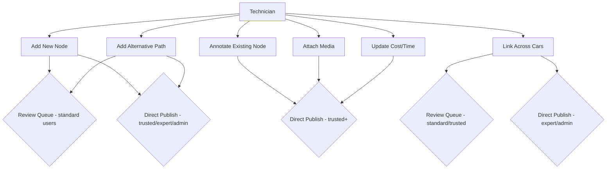


### How a Contribution Flows

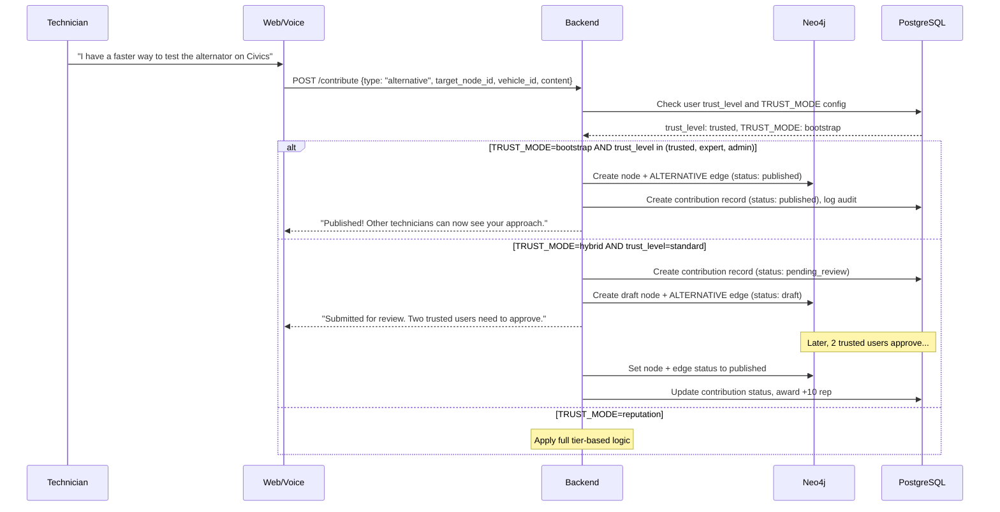

The contribution routing logic in pseudocode:

```
Contribution arrives:
  if TRUST_MODE == bootstrap:
    if user.trust_level in (trusted, expert, admin): publish directly
    else: reject (bootstrap mode is invite-only)
  elif TRUST_MODE == hybrid:
    if user.trust_level in (trusted, expert, admin): publish directly
    else: send to review (need 2 trusted approvals)
  elif TRUST_MODE == reputation:
    apply full tier-based logic (standard thresholds)
```


### What the Contribution Looks Like in the Graph

Before a technician contributes:

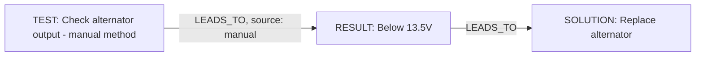

After a technician adds an alternative:

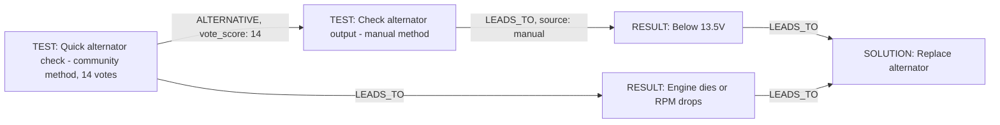


The ALTERNATIVE edge connects the community-contributed test to the original manual test. Users see both options, ranked by vote score. The manual path is always preserved as the "official" baseline.

---

## PostgreSQL Schema (Relational + Vector)

PostgreSQL handles everything that isn't the diagnostic graph itself:

```sql
-- Users and reputation
CREATE TABLE users (
    id UUID PRIMARY KEY DEFAULT gen_random_uuid(),
    email TEXT UNIQUE NOT NULL,
    display_name TEXT NOT NULL,
    user_type TEXT NOT NULL CHECK (user_type IN ('customer', 'technician', 'admin')),
    reputation INT DEFAULT 0,
    trust_level TEXT NOT NULL DEFAULT 'standard'
        CHECK (trust_level IN ('standard', 'trusted', 'expert', 'admin')),
    trust_source TEXT NOT NULL DEFAULT 'earned'
        CHECK (trust_source IN ('invited', 'earned', 'admin_granted')),
    specializations JSONB DEFAULT '[]',
    created_at TIMESTAMPTZ DEFAULT now()
);

-- Manual chunks for RAG / semantic search
CREATE TABLE manual_chunks (
    id UUID PRIMARY KEY DEFAULT gen_random_uuid(),
    vehicle_neo4j_id TEXT NOT NULL,       -- references Neo4j Vehicle node
    source_file TEXT NOT NULL,
    page_number INT,
    chunk_text TEXT NOT NULL,
    chunk_type TEXT NOT NULL,              -- procedure, diagram, parts_list, spec, warning
    embedding vector(1536),
    metadata JSONB DEFAULT '{}',
    created_at TIMESTAMPTZ DEFAULT now()
);
CREATE INDEX ON manual_chunks USING ivfflat (embedding vector_cosine_ops) WITH (lists = 100);

-- Contributions audit trail
CREATE TABLE contributions (
    id UUID PRIMARY KEY DEFAULT gen_random_uuid(),
    user_id UUID REFERENCES users(id),
    contribution_type TEXT NOT NULL,       -- new_node, alternative, annotation, attachment, cross_car_link, cost_update
    target_neo4j_node_id TEXT,            -- the node being modified/extended
    created_neo4j_node_id TEXT,           -- the new node created (if any)
    content JSONB NOT NULL,               -- full contribution payload
    status TEXT DEFAULT 'pending_review',  -- pending_review, published, rejected, superseded
    reviewed_by UUID REFERENCES users(id),
    reviewed_at TIMESTAMPTZ,
    review_notes TEXT,
    created_at TIMESTAMPTZ DEFAULT now()
);

-- Votes on Neo4j nodes (referenced by neo4j ID)
CREATE TABLE votes (
    id UUID PRIMARY KEY DEFAULT gen_random_uuid(),
    user_id UUID REFERENCES users(id),
    neo4j_node_id TEXT NOT NULL,
    vote_value INT NOT NULL CHECK (vote_value IN (-1, 1)),
    created_at TIMESTAMPTZ DEFAULT now(),
    UNIQUE(user_id, neo4j_node_id)
);

-- Diagnostic sessions (parent table, one per problem being diagnosed)
-- See "Session Lifecycle" section below for phase transitions and linked sessions
CREATE TABLE diagnostic_sessions (
    id UUID PRIMARY KEY DEFAULT gen_random_uuid(),
    user_id UUID REFERENCES users(id),
    vehicle_neo4j_id TEXT NOT NULL,
    starting_problem_neo4j_id TEXT NOT NULL,
    final_solution_neo4j_id TEXT,
    phase TEXT NOT NULL DEFAULT 'diagnosis'
        CHECK (phase IN ('diagnosis', 'estimate', 'decision', 'repair', 'verification', 'completed', 'abandoned')),
    parent_session_id UUID REFERENCES diagnostic_sessions(id),
    parent_link_reason TEXT
        CHECK (parent_link_reason IN ('discovered_during_diagnosis', 'discovered_during_repair', 'related_dtc')),
    chosen_path_neo4j_ids TEXT[],
    -- DTC input metadata (populated when session starts from DTC input)
    extracted_dtcs JSONB,                 -- [{code, description, source}] from text/image/PDF extraction
    dtc_clusters JSONB,                   -- [{root_cause, codes[], severity, problem_neo4j_id}]
    input_type TEXT CHECK (input_type IN ('text', 'image', 'pdf', 'conversation', 'linked')),
    source_file_urls TEXT[],              -- S3 URLs for uploaded images/PDFs
    created_at TIMESTAMPTZ DEFAULT now(),
    completed_at TIMESTAMPTZ
);

-- Individual diagnostic steps (replaces steps_taken JSONB)
CREATE TABLE session_steps (
    id UUID PRIMARY KEY DEFAULT gen_random_uuid(),
    session_id UUID NOT NULL REFERENCES diagnostic_sessions(id) ON DELETE CASCADE,
    step_order INT NOT NULL,
    neo4j_node_id TEXT NOT NULL,
    node_type TEXT NOT NULL CHECK (node_type IN ('Problem', 'Symptom', 'Test', 'Result', 'Solution')),
    user_answer TEXT,
    llm_interpretation TEXT,
    confidence FLOAT,
    created_at TIMESTAMPTZ DEFAULT now(),
    UNIQUE(session_id, step_order)
);

-- Estimates generated for a session
CREATE TABLE session_estimates (
    id UUID PRIMARY KEY DEFAULT gen_random_uuid(),
    session_id UUID NOT NULL REFERENCES diagnostic_sessions(id) ON DELETE CASCADE,
    estimate_snapshot JSONB NOT NULL,      -- frozen RepairEstimate (parts, labor, totals)
    total_parts_low DECIMAL,
    total_parts_high DECIMAL,
    total_labor_low DECIMAL,
    total_labor_high DECIMAL,
    currency TEXT DEFAULT 'USD',
    generated_at TIMESTAMPTZ DEFAULT now()
);

-- Customer decision on an estimate
CREATE TABLE session_decisions (
    id UUID PRIMARY KEY DEFAULT gen_random_uuid(),
    session_id UUID NOT NULL REFERENCES diagnostic_sessions(id) ON DELETE CASCADE,
    decision TEXT NOT NULL CHECK (decision IN ('approve', 'decline', 'defer', 'choose_alternative')),
    chosen_estimate_id UUID REFERENCES session_estimates(id),
    alternative_solution_neo4j_id TEXT,    -- if customer chose a different solution
    notes TEXT,
    decided_at TIMESTAMPTZ DEFAULT now()
);

-- Granular repair step tracking (one row per Step node in the solution)
CREATE TABLE session_repair_steps (
    id UUID PRIMARY KEY DEFAULT gen_random_uuid(),
    session_id UUID NOT NULL REFERENCES diagnostic_sessions(id) ON DELETE CASCADE,
    step_order INT NOT NULL,
    neo4j_step_id TEXT NOT NULL,
    title TEXT NOT NULL,
    status TEXT NOT NULL DEFAULT 'pending'
        CHECK (status IN ('pending', 'in_progress', 'completed', 'skipped', 'blocked')),
    skip_reason TEXT,
    technician_notes TEXT,
    started_at TIMESTAMPTZ,
    completed_at TIMESTAMPTZ,
    UNIQUE(session_id, step_order)
);

-- Links between parent and child sessions (cascading problems)
CREATE TABLE session_links (
    id UUID PRIMARY KEY DEFAULT gen_random_uuid(),
    parent_session_id UUID NOT NULL REFERENCES diagnostic_sessions(id) ON DELETE CASCADE,
    child_session_id UUID NOT NULL REFERENCES diagnostic_sessions(id) ON DELETE CASCADE,
    link_reason TEXT NOT NULL
        CHECK (link_reason IN ('discovered_during_diagnosis', 'discovered_during_repair', 'related_dtc')),
    discovered_at_step TEXT,              -- which step revealed the new problem
    created_at TIMESTAMPTZ DEFAULT now(),
    UNIQUE(parent_session_id, child_session_id)
);

-- Pricing data (crowdsourced + manual)
CREATE TABLE pricing_data (
    id UUID PRIMARY KEY DEFAULT gen_random_uuid(),
    neo4j_solution_id TEXT NOT NULL,
    vehicle_neo4j_id TEXT,
    region TEXT,                           -- zip code prefix or metro area
    parts_cost_low DECIMAL,
    parts_cost_high DECIMAL,
    labor_cost_low DECIMAL,
    labor_cost_high DECIMAL,
    labor_hours_est DECIMAL,
    source TEXT NOT NULL,                  -- manual, technician, aggregated
    reported_by UUID REFERENCES users(id),
    reported_at TIMESTAMPTZ DEFAULT now()
);
```

---

## Dual-Database Sync Pattern

The two databases reference each other by Neo4j node IDs stored as text fields in PostgreSQL. This is intentionally loose coupling.

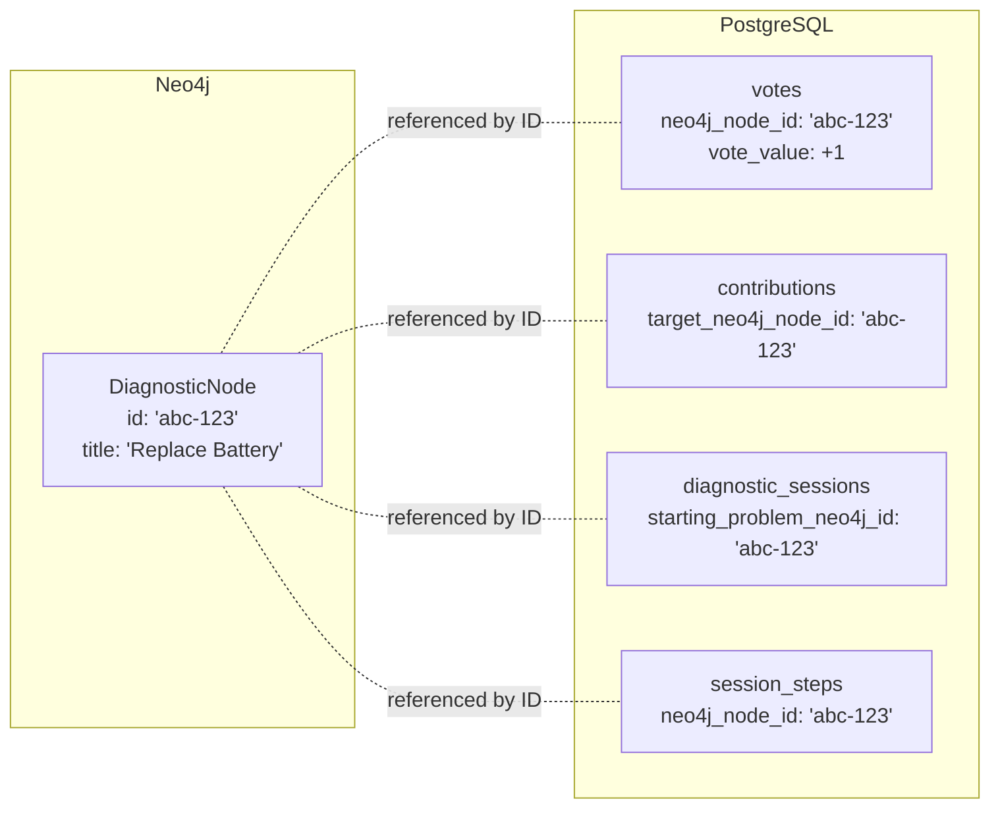


**Vote score sync:** When a vote is cast in PostgreSQL, a background task aggregates the score and writes it back to the Neo4j node's `vote_score` property. This is eventually consistent (seconds, not minutes) and avoids Neo4j write contention.

---

## Updated Architecture

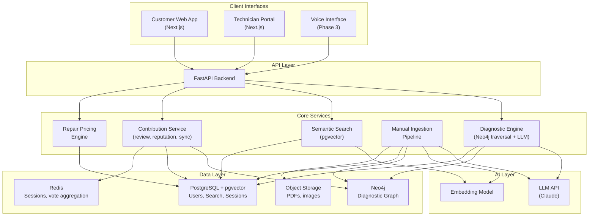


---

## How the Diagnostic Decision Tree Works

Example tree for "Engine Won't Start" (unchanged from v1, but now natively stored as Neo4j graph):

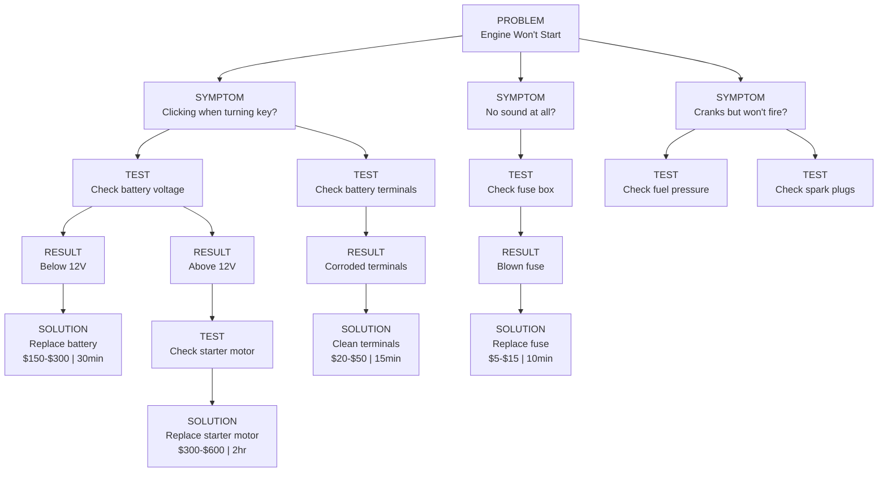


The customer walks through this interactively. The LLM helps interpret natural language ("it makes a clicking noise") into the right symptom branch. Neo4j handles the traversal natively with Cypher.

---

## PDF Manual Ingestion Pipeline

The pipeline runs in two phases: first extract all diagnoses (structure), then resolve all steps and references (including diagrams). This ensures the skeleton is complete before filling in diagram content, cross-references, and step-level detail.

### Phase 1: Extract Diagnoses

Parse the PDF, chunk by section, and extract the diagnostic structure. The LLM identifies Problem → Symptom → Test → Result → Solution chains and **captures all references** (figure numbers, diagram refs, page cross-refs) without resolving them yet.

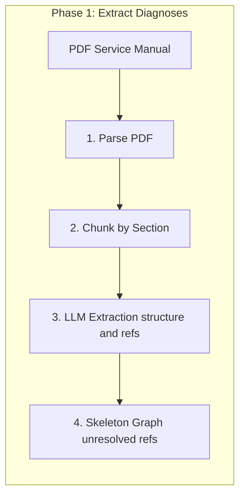

**Output of Phase 1:** Diagnostic structure with unresolved references (e.g. "See Figure 12-34", "Wiring diagram p.412", "Component locations below").

### Phase 2: Resolve Steps and References

Resolve all references, extract and process diagrams, fill in step details, then write to both databases.

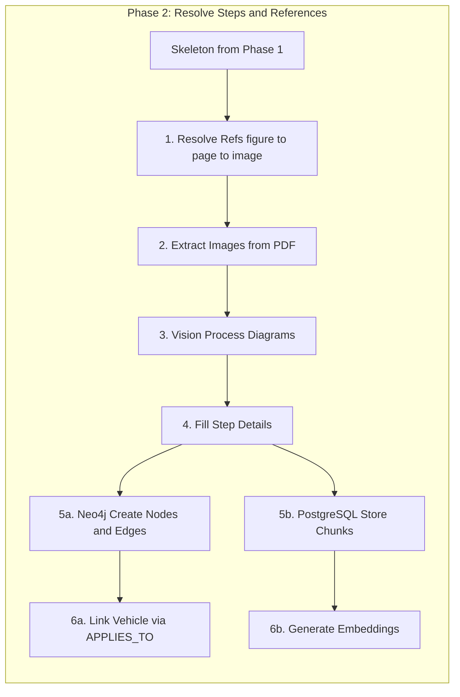

**Reference resolution:** Map "Figure 12-34", "page 412", "diagram below" to actual image locations in the PDF. Heuristics or a lightweight LLM pass handle inconsistent numbering.

**Diagram processing:** Part diagrams (callouts, exploded views), wiring diagrams (wire colors, pinouts), schematics (symbols, connections). Vision extracts structured data; images are stored in S3 and linked via `media_refs` on Step/Test nodes.

**Final output:** Full graph in Neo4j, chunks with embeddings in PostgreSQL, all references resolved and diagram content attached.


---

## LLM Architecture: Three Distinct Roles

The LLM (Claude API) is used in three fundamentally different ways. Each has different latency requirements, cost profiles, and failure modes.

### Role 1: Ingestion LLM (Batch, Offline)

Runs once per service manual. Not user-facing. Can be slow, can retry, cost is fixed.

**What it does (Phase 1):** Reads chunks of PDF text and extracts the diagnostic structure -- node types, relationships, conditions, tools required. Turns prose like "If the battery reads below 12V, replacement is necessary" into a Problem->Test->Result->Solution graph path. **Captures all references** (figure numbers, diagram refs, page cross-refs) for Phase 2 resolution.

**When it runs:** During PDF ingestion only. Never on a user request.

**Model:** Claude (Sonnet or Haiku depending on cost/quality tradeoff for extraction).

**Failure mode:** If extraction is wrong, you get bad graph data. Mitigated by human review of ingested content before publishing.

### Role 2: Conversational LLM (Real-Time, Every User Turn)

This is the critical path. The LLM sits between the customer and the diagnostic graph. It is called on every single turn of the conversation. Without it, the customer would have to navigate a rigid decision tree by clicking buttons. With it, they describe their problem in plain language and get a mechanic-like conversation.

**What it does on each turn:**

```
Turn 1 (Session Start):
  Input:  "My 2019 Civic won't start"
  LLM:    Extract {vehicle: "2019 Honda Civic", symptom: "won't start"}
          -> pgvector search on symptom embedding
          -> Neo4j fetch matching Problem nodes for this vehicle
          -> LLM picks best match, generates first question
  Output: "I can help with that. When you turn the key, what happens?
           Does it make a clicking sound, is there no sound at all,
           or does the engine crank but not fire up?"

Turn 2 (Mid-Diagnosis):
  Input:  "yeah it clicks"
  LLM:    Map "yeah it clicks" -> Symptom node "Clicking when turning key"
          -> Neo4j traverse from that Symptom to child Test nodes
          -> LLM formats the next test instruction conversationally
  Output: "That clicking usually points to a battery or starter issue.
           If you have a multimeter, check the battery voltage across
           the terminals. What reading do you get?"

Turn 3 (Test Result):
  Input:  "it says 11.2"
  LLM:    Map "11.2" -> Result node "Below 12V"
          -> Neo4j traverse to Solution node
          -> LLM pulls pricing data from PostgreSQL
          -> LLM generates diagnosis with cost estimate
  Output: "Your battery is dead -- 11.2V is well below the 12.6V a
           healthy battery should read. You'll need a replacement.
           For a 2019 Civic, expect $150-$250 for the battery plus
           about 30 minutes of labor ($50-$80). Most auto parts
           stores will install it free if you buy from them."
```

**What the LLM is NOT doing:** It is not diagnosing the car from its own training data. It is reading the graph and translating. The graph is the source of truth. The LLM is the translator between human language and graph operations. If the graph says "Below 12V -> Replace Battery," the LLM says that. It does not freelance.

**How this is enforced:** The LLM prompt includes the current graph context (the node it's on, the child nodes available, the edge conditions) and explicit instructions: "Your job is to help the user navigate this diagnostic tree. Only present options that exist as child nodes. Do not invent diagnoses."

**Per-turn LLM call structure:**

```
System prompt:
  You are a diagnostic assistant. You help customers diagnose car problems
  by walking them through a structured diagnostic tree. You ONLY present
  diagnostic steps, tests, and solutions that exist in the provided graph
  context. You never invent diagnoses or skip steps.

  Current session:
    Vehicle: {vehicle}
    Current node: {node_type}: {node_title}
    Available next steps: [{child_node_1}, {child_node_2}, ...]
    Path so far: [{step_1} -> {step_2} -> ...]

User message:
  {customer's natural language input}

Expected output:
  1. Which child node does the user's response map to (structured JSON)
  2. Natural language response to show the customer (conversational text)
```

The backend parses the structured JSON to advance the graph traversal, and returns the conversational text to the frontend. This means the graph state machine is authoritative -- the LLM cannot skip nodes or jump to a wrong branch.

### Role 3: Contribution LLM (Optional, Assists Technicians)

Not critical for MVP. When a technician submits a contribution in free text, the LLM can help structure it into proper node format (suggest node type, extract relationships). This is a convenience feature, not a core dependency.

---

## Multi-Modal DTC Input and Correlation

> Detailed sub-plan: [dtc_input_architecture_f4496677.plan.md](/home/varjitt/.cursor/plans/dtc_input_architecture_f4496677.plan.md)

Users rarely type DTC codes manually in a chat. They read them off a scan tool, photograph the scan tool screen, or have a PDF diagnostic report from a shop. All three entry methods produce a standardized extraction result.

### Input Preprocessors

Three handlers in `backend/app/services/input/`:

- `text_parser.py` -- Regex extraction of DTC patterns (P0XXX, B0XXX, C0XXX, U0XXX) from free text, plus LLM for vehicle context
- `image_extractor.py` -- Sends uploaded image to Claude Vision to extract all DTC codes, severity indicators, and contextual info (freeze frame data, mileage)
- `report_parser.py` -- PDF text extraction (reuses `pdf_parser.py`), then regex + LLM extraction of DTC codes and metadata

All three produce a standardized result:

```python
@dataclass
class ExtractedDTC:
    code: str                  # "P0171"
    description: str | None    # "System Too Lean Bank 1"
    status: str | None         # "confirmed", "pending", "history"
    freeze_frame: dict | None  # mileage, RPM, temp at time of code
    source: str                # "user_typed", "image_ocr", "pdf_report"

@dataclass
class DTCExtractionResult:
    codes: list[ExtractedDTC]
    vehicle_info: dict | None  # VIN, make/model/year if found in report
    raw_text: str | None       # OCR'd or extracted text for audit trail
    source_file_url: str | None  # S3 link to uploaded image/PDF
```

### DTC Correlation Engine

Service: `backend/app/services/dtc_correlator.py`

Multiple DTCs often share a single root cause. For example, P0171 (System Too Lean) + P0174 (System Too Lean Bank 2) + P0101 (MAF Sensor Range) likely all point to a faulty MAF sensor or a vacuum leak. The correlation engine groups codes before diagnosis starts.

Two correlation sources:

- **Graph-based**: Query Neo4j for Problem nodes linked to multiple extracted codes. A Problem matching 3 of 5 codes is likely the root cause.
- **LLM-assisted**: When graph coverage is incomplete, Claude analyzes the code cluster and suggests the most likely root problem, matched to existing Problem nodes via pgvector search.

```python
@dataclass
class DTCCluster:
    root_problem_neo4j_id: str | None
    root_description: str              # "Likely vacuum leak or MAF sensor failure"
    related_codes: list[str]           # ["P0171", "P0174", "P0101"]
    confidence: float
    reasoning: str

@dataclass
class DTCCorrelationResult:
    clusters: list[DTCCluster]         # grouped by root cause, sorted by severity
    uncorrelated_codes: list[str]
    recommended_start: str             # neo4j ID of Problem to diagnose first
```

### DTC Input Flow

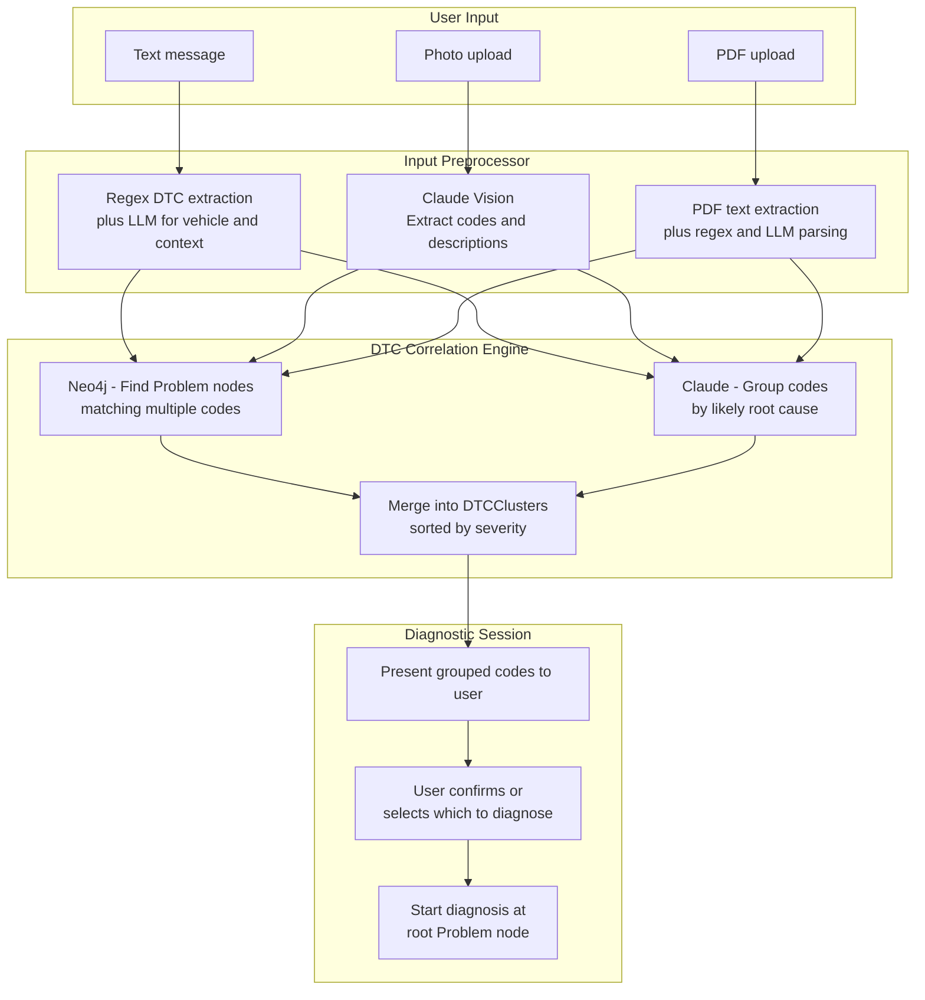

DTC data is stored on `diagnostic_sessions`: `extracted_dtcs`, `dtc_clusters`, `input_type`, and `source_file_urls` (see PostgreSQL schema above).

---

## Detailed Customer Diagnostic Flow

This replaces the earlier simplified sequence diagram. Every LLM call is explicit.

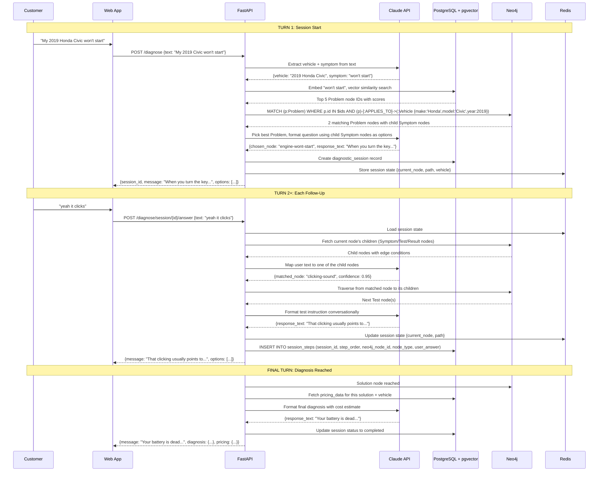


**Key detail: The LLM is called 2 times per turn** (once to interpret the user's input and map it to a graph node, once to format the response). These can potentially be combined into a single call with structured output, but keeping them separate makes the system easier to debug -- you can see exactly where a misinterpretation happened (bad node mapping vs. bad response formatting).

---

## LLM Cost and Latency Estimates

For a typical 5-turn diagnostic session:

- **LLM calls per session:** ~10 (2 per turn)
- **Tokens per call:** ~500 input (system prompt + graph context + user message) + ~200 output
- **Total tokens per session:** ~7,000
- **Cost per session (Claude Sonnet):** ~$0.02-0.04
- **Latency per LLM call:** ~500ms-1.5s (acceptable for conversational UI)
- **Total session latency budget:** Graph queries add ~50ms each, so total per-turn latency is dominated by LLM time

For DTC image/PDF extraction (Claude Vision):
- **Cost per image:** ~$0.01-0.03 (depends on resolution and token count)
- **Cost per PDF report:** ~$0.05-0.15 (multi-page, extracted page-by-page)
- **Latency per image:** ~1-3s (single API call)

For the ingestion LLM (batch):
- **Tokens per manual:** Varies, but a 500-page service manual might produce ~200 chunks, each needing ~2,000 tokens of LLM processing
- **Cost per manual ingestion:** ~$2-5
- **Time per manual:** 10-30 minutes (parallelizable)


---

## Parts, Pricing, and Repair Procedures

This section covers what happens after a diagnosis is reached: identifying what parts are needed, where to get them, what they cost (with role-based pricing), what the repair procedure looks like, and compiling it all into an estimate.

### Enriched Graph Model: Solution -> Steps -> Parts + Tools

The current graph has Solution and Step nodes, but they're too thin. Here's the enriched model:

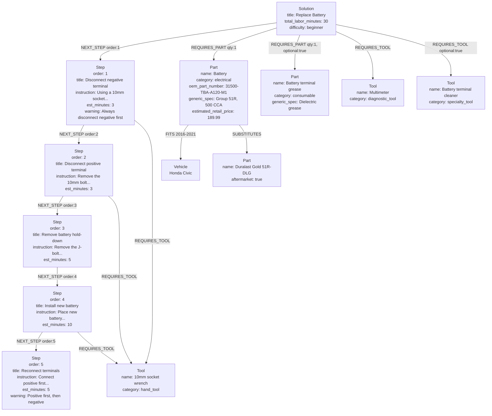

**Key properties on each node type:**

- **Problem**: `title`, `description`, `dtc_codes` (string array -- e.g. `["P0300", "P0301", "P0302"]`, enables DTC-to-Problem lookup)
- **Symptom**: `title`, `description`, `question_text` (what to ask the user)
- **Test**: `title`, `instruction`, `expected_result`, `tool_required`
- **Result**: `title`, `value_type` (boolean, range, text), `interpretation`
- **Solution**: `title`, `total_labor_minutes`, `difficulty` (beginner/intermediate/advanced), `source_type` (manual/technician), `precautions` (safety notes)
- **Step**: `order`, `title`, `instruction` (detailed text), `est_minutes`, `warning` (optional safety callout), `media_refs` (links to images/diagrams in S3)
- **Part**: `name`, `category`, `oem_part_number`, `generic_spec` (human-readable spec like "Group 51R, 500 CCA"), `aftermarket` (bool), `estimated_retail_price` (optional, from manual or technician input -- used as OEM price baseline when no marketplace Tier 1 result exists)
- **Tool**: `name`, `category` (hand_tool, power_tool, specialty_tool, diagnostic_tool), `common` (bool -- most shops have this)
- **Vehicle**: `make`, `model`, `year`, `engine`, `trim`
- **System**: `name` (e.g. "Electrical", "Fuel", "Ignition")
- **Component**: `name`, `system` (reference to parent system)

**DTC index for fast code lookups:**

```cypher
CREATE INDEX problem_dtc_idx FOR (p:Problem) ON (p.dtc_codes)
```

**Example: Finding Problems by DTC codes:**

```cypher
MATCH (p:Problem)
WHERE ANY(code IN ["P0300", "P0301", "P0302"] WHERE code IN p.dtc_codes)
OPTIONAL MATCH (p)-[:APPLIES_TO]->(v:Vehicle {make: $make, model: $model, year: $year})
RETURN p, v
ORDER BY size([c IN p.dtc_codes WHERE c IN ["P0300", "P0301", "P0302"]]) DESC
```

**Key relationships:**

- `NEXT_STEP {step_order}` -- Ordered chain from Solution through Steps
- `REQUIRES_PART {quantity, optional}` -- Links Solution or Step to Part nodes
- `REQUIRES_TOOL {optional}` -- Links Solution or Step to Tool nodes
- `FITS {year_start, year_end, trim, notes}` -- Links Part to Vehicle (fitment)
- `SUBSTITUTES {direction, notes}` -- Links OEM Part to aftermarket/compatible Parts

### Parts Provider Architecture (Plugin System)

No single API covers worldwide parts pricing. Instead, we build a provider abstraction that queries multiple sources in parallel and returns unified results. New providers are added by implementing a Python interface -- no schema changes needed. Phase 1 uses free marketplace APIs (Amazon, eBay). Paid structured catalogs (TecDoc, WorldPac) are added in Phase 2+ when revenue justifies the cost.

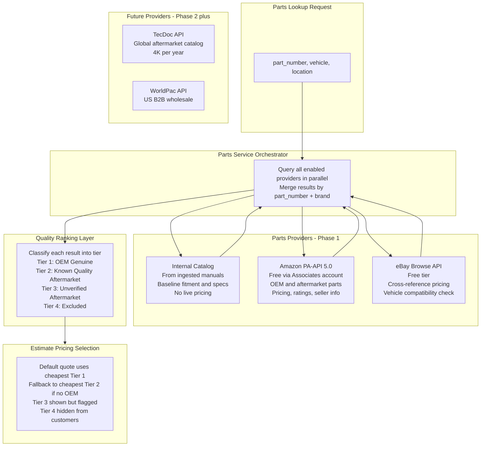

**Provider interface (Python ABC):**

```python
class PartsProvider(ABC):
    provider_name: str
    supports_pricing: bool
    supports_availability: bool
    supports_location: bool
    coverage_regions: list[str]  # ["US", "EU", "GLOBAL", etc.]

    @abstractmethod
    async def search_parts(
        self,
        part_number: str | None,
        generic_spec: str | None,
        vehicle: VehicleLookup,
        location: GeoLocation | None,
    ) -> list[PartResult]:
        """Return matching parts with pricing and availability."""

    @abstractmethod
    async def check_availability(
        self,
        provider_part_id: str,
        location: GeoLocation,
    ) -> AvailabilityResult:
        """Check stock and delivery time for a specific part at a location."""
```

**PartResult model (what every provider returns):**

```python
@dataclass
class PartResult:
    provider: str              # "amazon", "ebay", "internal"
    part_number: str
    name: str
    brand: str
    fits_vehicle: bool         # confirmed fitment
    price: Decimal | None      # None if provider doesn't have pricing
    price_type: str            # "retail", "marketplace", "wholesale", "list"
    currency: str              # ISO 4217
    in_stock: bool | None
    quantity_available: int | None
    location_name: str | None  # "Amazon.com" or "eBay - seller_name"
    distance_km: float | None  # from user/shop location (for future local providers)
    delivery_estimate: str | None  # "Same day", "1-2 business days"
    url: str | None            # buy link (Amazon/eBay product page)
    rating: float | None       # star rating (1.0-5.0) from marketplace
    review_count: int | None   # number of reviews
    seller_name: str | None    # who is selling it
    quality_tier: int | None   # 1-4, assigned by ranking layer after merge
```

### Parts Quality Ranking (4-Tier System)

Marketplace APIs (Amazon, eBay) return a mix of genuine OEM parts, trusted aftermarket brands, unknown brands, and outright counterfeits. A $20 MAF sensor listed next to the $180 genuine part is almost certainly fake. The ranking system classifies every result to protect estimate accuracy.

**Tier definitions:**

| Tier | Label | Criteria | Estimate behavior |
|------|-------|----------|-------------------|
| 1 | OEM Genuine | Brand matches vehicle manufacturer (e.g., Toyota, Denso for Toyota), or sold by authorized dealer | **Default estimate price** -- most trustworthy |
| 2 | Known Quality Aftermarket | Brand on curated `brand_allowlist` + good ratings (4+ stars, 50+ reviews) | Shown as alternative, lower price |
| 3 | Unverified Aftermarket | Brand not on allowlist, low reviews, or price >50% below Tier 1 median | Shown with warning badge |
| 4 | Excluded | Price >70% below OEM median, rating <3 stars, or brand on `brand_blocklist` | Hidden from customers entirely |

**Classification logic (Python pseudocode):**

```python
def classify_part(
    result: PartResult,
    oem_brands: set,
    allowlist: set,
    blocklist: set,
    oem_median: Decimal,
) -> int:
    if result.brand.lower() in blocklist:
        return 4
    if result.price and oem_median and result.price < oem_median * Decimal("0.30"):
        return 4
    if result.rating is not None and result.rating < 3.0:
        return 4

    if result.brand.lower() in oem_brands:
        return 1

    if result.brand.lower() in allowlist:
        if result.rating is None or (result.rating >= 4.0 and result.review_count >= 50):
            return 2

    if result.price and oem_median and result.price < oem_median * Decimal("0.50"):
        return 3

    return 3  # default: unverified
```

**OEM median calculation:** After merging results from all providers for a given `part_number`, we filter to Tier 1 results and take the median price. This median is used as the baseline for outlier detection in Tiers 3 and 4. If no Tier 1 results exist, we fall back to the `estimated_retail_price` stored on the graph `Part` node (from the service manual or technician input).

**Brand allowlist/blocklist tables (PostgreSQL):**

```sql
CREATE TABLE brand_allowlist (
    id UUID PRIMARY KEY DEFAULT gen_random_uuid(),
    brand_name TEXT NOT NULL UNIQUE,
    brand_name_lower TEXT NOT NULL UNIQUE GENERATED ALWAYS AS (lower(brand_name)) STORED,
    category TEXT,                         -- "electrical", "engine", "brakes", etc.
    is_oem BOOLEAN DEFAULT false,          -- true for Toyota, Honda, Denso-as-OEM, etc.
    oem_for_makes TEXT[] DEFAULT '{}',     -- ["Toyota", "Lexus"] for Denso
    added_by UUID REFERENCES users(id),
    added_at TIMESTAMPTZ DEFAULT now()
);

CREATE TABLE brand_blocklist (
    id UUID PRIMARY KEY DEFAULT gen_random_uuid(),
    brand_name TEXT NOT NULL UNIQUE,
    brand_name_lower TEXT NOT NULL UNIQUE GENERATED ALWAYS AS (lower(brand_name)) STORED,
    reason TEXT,                            -- "Known counterfeit seller", "Consistently low quality"
    added_by UUID REFERENCES users(id),
    added_at TIMESTAMPTZ DEFAULT now()
);
```

These tables are seeded with an initial set of known OEM and quality aftermarket brands (Denso, Bosch, NGK, ACDelco, Motorcraft, etc.) and known bad brands. Technicians with sufficient reputation can propose additions, which are reviewed before being applied.

### Pricing Strategy: Live Lookup + Snapshot

**We do not store a parts price catalog.** Prices are volatile, provider-dependent, and region-specific. Maintaining our own price table would mean complex sync jobs, staleness risk, and massive data volume for no real benefit.

Instead:

1. **Live lookup at query time** -- when a user views parts for a solution, we query enabled providers in real-time.
2. **Redis cache (1-4hr TTL)** -- responses are cached by `provider:part_number:vehicle:location` so repeated lookups in the same session (or by other users searching the same part nearby) don't re-hit the API.
3. **Freeze into estimate on save** -- when an estimate is generated, the prices seen at that moment are snapshot into the `estimate` record in PostgreSQL. That record is immutable. If the user re-generates later, they get fresh prices and a new estimate record.
4. **Price history is deferred** -- no dedicated tracking table in Phase 1. If needed later, we can mine saved estimates or add a table in Phase 2+.

### Pricing Logic: Tier-Based Selection

The estimate selects a price for each required part using the quality tier ranking:

```
Pricing logic per part:

1. Cheapest Tier 1 (OEM Genuine) result -- DEFAULT for estimate
   This is the most trustworthy price and what we quote customers.

2. If no Tier 1 results exist:
   Cheapest Tier 2 (Known Quality Aftermarket) result
   Estimate notes: "No OEM source found; using trusted aftermarket"

3. If no Tier 1 or Tier 2 results exist:
   estimated_retail_price from graph Part node (from service manual)
   Estimate notes: "Price from service manual catalog; verify before ordering"

4. Tier 3 results shown as alternatives with warning badge
   "Unverified brand -- quality not confirmed"

5. Tier 4 results hidden from customers entirely
   Techs can opt-in to see them via shop settings
```

**For technician sessions with wholesale enabled (Phase 2+):**

When wholesale providers (WorldPac, etc.) are integrated, techs see B2B wholesale prices alongside marketplace prices. Customers never see wholesale prices. When wholesale is the only source, the system applies a configurable markup.

```
IF wholesale_price available AND user is tech with wholesale enabled:
  tech sees:     wholesale_price + marked-up customer price for reference
  customer sees: wholesale_price * (1 + markup_pct)

markup_pct is configurable per shop (default: 35-50%)
```

This is stored in PostgreSQL, not the graph:

```sql
CREATE TABLE shop_settings (
    id UUID PRIMARY KEY DEFAULT gen_random_uuid(),
    user_id UUID NOT NULL REFERENCES users(id),
    shop_name TEXT NOT NULL,
    location_lat DECIMAL,
    location_lng DECIMAL,
    address TEXT,
    default_markup_pct DECIMAL DEFAULT 0.40,
    category_markups JSONB DEFAULT '{}',
    labor_rate_per_hour DECIMAL,
    enabled_providers TEXT[] DEFAULT '["amazon", "ebay"]',
    enabled_wholesale_providers TEXT[] DEFAULT '{}',
    wholesale_credentials JSONB DEFAULT '{}',
    show_tier4 BOOLEAN DEFAULT false,
    created_at TIMESTAMPTZ DEFAULT now()
);
```

### Estimate Generation Flow

Once a diagnosis reaches a Solution node, the system compiles a line-item estimate. This is the final output of a diagnostic session.

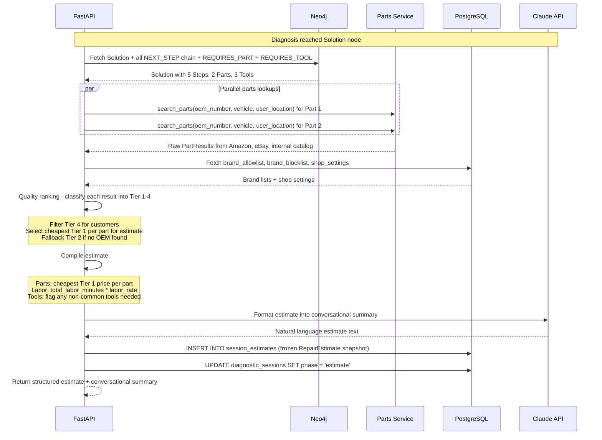

**Estimate data model (returned to frontend):**

```python
@dataclass
class RepairEstimate:
    solution_title: str
    difficulty: str
    total_labor_minutes: int
    steps: list[RepairStep]       # ordered, with instructions
    parts: list[PartLineItem]     # each with best price, alternatives, availability
    tools: list[ToolRequirement]  # flagging any the user might not have
    labor_cost: MoneyRange        # low-high based on labor rate
    parts_cost: MoneyRange        # low-high across alternatives
    total_cost: MoneyRange        # labor + parts
    currency: str
    nearest_parts_source: str     # "AutoZone - 2.3 km away" or "WorldPac Dallas"
    conversational_summary: str   # LLM-generated plain-English summary
```

This is what gets displayed in the app and what gets persisted to `session_estimates.estimate_snapshot` as a frozen JSONB snapshot linked to the diagnostic session. The session phase transitions from `diagnosis` to `estimate` when this record is created. The frontend renders it as a structured card with expandable sections (steps, parts with prices, total). It can also be exported to PDF for the customer. Re-generating an estimate always creates a new `session_estimates` row with fresh prices -- old estimates are never mutated. If the customer requests an alternative solution, a new estimate is generated for the alternative and saved as a separate row.

### Location-Aware Lookups

Both customers and techs have location context:

- **Customers**: Browser geolocation (with permission) or manually entered zip/postal code. Used to find nearest retail parts sources.
- **Techs**: Shop address from `shop_settings`. Used to query B2B warehouse availability and delivery times.

The Parts Service passes `GeoLocation(lat, lng)` to each provider. Amazon and eBay use this for shipping estimates and regional availability. For the internal catalog (no live inventory), location is not applicable. In Phase 2, TecDoc supports regional queries natively and WorldPac returns warehouse locations with distance.

---

## Session Lifecycle

> Detailed sub-plan: [session_model_redesign_0fef93df.plan.md](/home/varjitt/.cursor/plans/session_model_redesign_0fef93df.plan.md)

Every diagnostic session follows a strict phase lifecycle. The `phase` column on `diagnostic_sessions` governs what actions are valid at any point. Phase transitions are explicit -- a session cannot jump from `diagnosis` to `completed`.

### Phase State Diagram

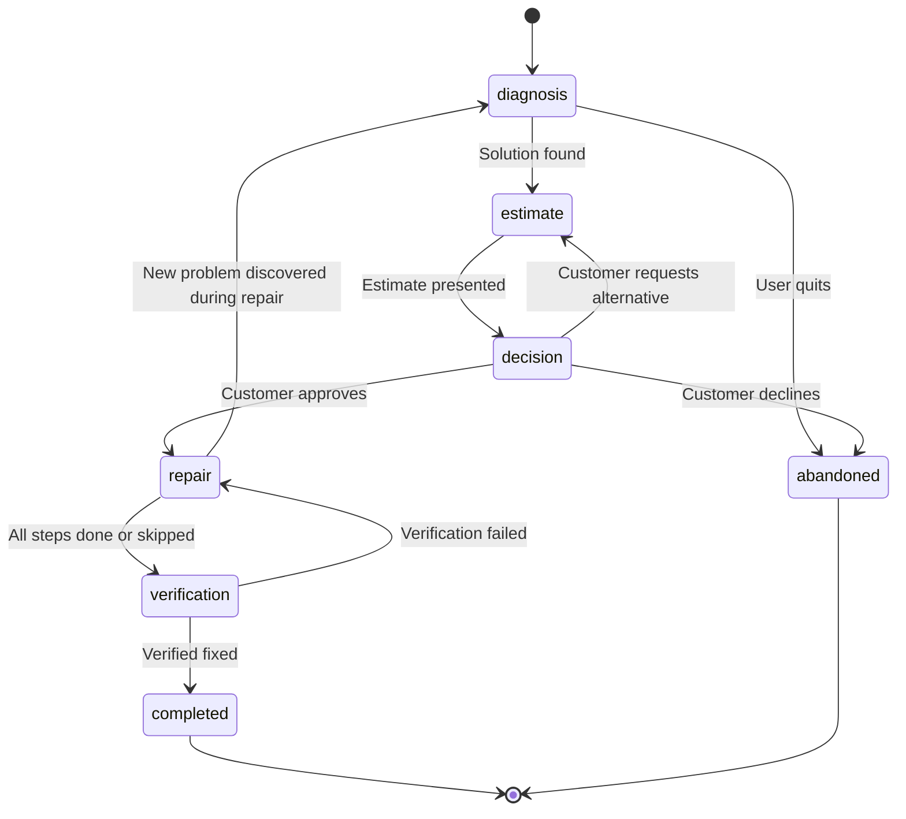

### Phase Transition Rules

| From | To | Trigger |
|---|---|---|
| diagnosis | estimate | `final_solution_neo4j_id` set, estimate generated and saved to `session_estimates` |
| estimate | decision | Estimate presented to customer |
| decision | repair | Customer approves via `session_decisions` (decision = 'approve') |
| decision | abandoned | Customer declines (decision = 'decline') |
| decision | estimate | Customer requests alternative solution (decision = 'choose_alternative') |
| repair | verification | All `session_repair_steps` are `completed` or `skipped` (with reason) |
| repair | diagnosis | Technician discovers new problem during repair -- spawns child session |
| verification | completed | Verification passes |
| verification | repair | Verification fails -- back to repair |
| any phase | abandoned | User or technician abandons session |

### Session Completion Rules

A session reaches `completed` only when:

1. All `session_repair_steps` are either `completed` or `skipped` (each skip requires a `skip_reason`)
2. If any child sessions exist (via `session_links`), they must all be `completed` or `abandoned`
3. Verification step passes (optional but recommended -- the system prompts for it but does not block completion)

### Linked Sessions: Cascading Problems

When diagnosing or repairing one problem reveals another, the system spawns a child session linked to the parent. Each child has its own full lifecycle.

Example:

```
Session A: "Engine Knock" (root)
  -> Diagnosis: knock detected
  -> Solution: Engine rebuild
  -> During repair step 12 "Inspect oil pump", technician finds pump failed
  -> Spawns Session B (child of A)

Session B: "Oil Pump Failure" (child of A)
  -> parent_session_id = Session A
  -> parent_link_reason = "discovered_during_repair"
  -> Its own diagnosis, estimate, decision, repair tracking
```

The frontend displays the full chain: "This vehicle has 2 linked issues." Session A cannot complete until Session B is resolved.

### Redis Session State

Redis still holds the hot path for active sessions:

- Current graph node position
- Current phase
- Conversation history (recent turns for LLM context window)

Persistent state lives in the normalized PostgreSQL tables. On reconnection, the API hydrates Redis from PostgreSQL if the cache has expired.

---

## Tech Stack (updated)

- **Frontend**: Next.js 14 + TypeScript + Tailwind
- **Backend**: Python + FastAPI
- **Graph Database**: Neo4j 5 (diagnostic tree, cross-car relationships)
- **Relational + Vector DB**: PostgreSQL 16 + pgvector (users, sessions, search, estimates, brand lists, shop settings)
- **Cache**: Redis (session state, vote aggregation buffer, parts price cache with 1-4hr TTL)
- **Object Storage**: S3 or MinIO (PDFs, images, schematics)
- **AI - LLM**: Claude API (Anthropic)
- **AI - Vision**: Claude Vision (DTC code extraction from scan tool photos, ~$0.01-0.03 per image; diagram processing during ingestion, ~$0.01-0.03 per diagram)
- **AI - Embeddings**: OpenAI text-embedding-3-small (1536 dims)
- **Parts - Phase 1 Marketplace**: Amazon PA-API 5.0 (free via Associates), eBay Browse API (free tier)
- **Parts - Phase 1 Internal**: Catalog from ingested service manuals (fitment, specs, baseline price)
- **Parts - Phase 2 Global (deferred)**: TecDoc API (TecAlliance) -- aftermarket catalog, ~$4K/yr
- **Parts - Phase 2 US B2B (deferred)**: WorldPac speedDIAL 2.0 API -- wholesale pricing and inventory
- **Parts Quality**: 4-tier ranking system with brand allowlist/blocklist
- **Deployment**: Docker Compose (dev), AWS ECS or Railway (prod)

---

## Project Structure (updated)

```
connected-diagnostics/
├── backend/
│   ├── app/
│   │   ├── main.py
│   │   ├── api/routes/
│   │   │   ├── diagnose.py          # Customer diagnostic flow
│   │   │   ├── contribute.py        # Technician contributions
│   │   │   ├── vehicles.py          # Vehicle CRUD
│   │   │   ├── nodes.py             # Diagnostic node browsing
│   │   │   ├── search.py            # Semantic search
│   │   │   ├── review.py            # Contribution review queue
│   │   │   ├── parts.py             # Parts search and pricing
│   │   │   ├── estimates.py         # Estimate generation and retrieval
│   │   │   ├── sessions.py          # Session lifecycle, phase transitions, linked sessions
│   │   │   ├── shops.py             # Shop settings (markup, labor rate, location)
│   │   │   └── auth.py              # Registration, login
│   │   ├── core/
│   │   │   ├── config.py
│   │   │   └── security.py
│   │   ├── db/
│   │   │   ├── neo4j_client.py      # Neo4j connection + helpers
│   │   │   ├── postgres.py          # SQLAlchemy async engine
│   │   │   └── redis_client.py      # Redis connection
│   │   ├── models/                  # SQLAlchemy models (PostgreSQL)
│   │   │   ├── user.py
│   │   │   ├── manual_chunk.py
│   │   │   ├── contribution.py
│   │   │   ├── vote.py
│   │   │   ├── session.py              # diagnostic_sessions table
│   │   │   ├── session_steps.py        # session_steps table (per-step diagnostic tracking)
│   │   │   ├── session_estimates.py    # session_estimates table (frozen estimate snapshots)
│   │   │   ├── session_decisions.py    # session_decisions table (customer approve/decline)
│   │   │   ├── session_repair_steps.py # session_repair_steps table (granular repair tracking)
│   │   │   ├── session_links.py        # session_links table (parent/child cascading problems)
│   │   │   ├── shop_settings.py     # Shop location, markup rules, labor rate, provider config
│   │   │   ├── estimate.py          # Saved estimates with frozen prices at time of generation
│   │   │   ├── brand_allowlist.py   # Curated list of trusted aftermarket brands
│   │   │   └── brand_blocklist.py   # List of known unreliable brands
│   │   ├── graph/                   # Neo4j graph operations
│   │   │   ├── schema.py            # Cypher for constraints/indexes
│   │   │   ├── queries.py           # Reusable Cypher query templates
│   │   │   ├── traversal.py         # Diagnostic path traversal logic
│   │   │   └── mutations.py         # Node/edge creation and updates
│   │   ├── services/
│   │   │   ├── diagnostic_engine.py    # Orchestrates per-turn loop: LLM -> graph -> LLM -> response
│   │   │   ├── search_service.py       # pgvector similarity search
│   │   │   ├── contribution_service.py # Contribution + reputation logic
│   │   │   ├── review_service.py       # Review queue management
│   │   │   ├── estimate_service.py     # Compiles Solution -> parts lookup -> labor calc -> estimate
│   │   │   ├── session_service.py      # Session lifecycle, phase transitions, linked sessions
│   │   │   ├── sync_service.py         # Neo4j <-> PostgreSQL sync (votes, etc.)
│   │   │   ├── input/                  # Multi-modal DTC code input
│   │   │   │   ├── text_parser.py      # Regex + LLM extraction of DTC codes from free text
│   │   │   │   ├── image_extractor.py  # Claude Vision OCR for scan tool photos
│   │   │   │   └── report_parser.py    # PDF report parsing (PyMuPDF + regex/LLM)
│   │   │   ├── dtc_correlator.py       # Groups related DTCs into root-cause clusters
│   │   │   ├── parts/
│   │   │   │   ├── base.py             # PartsProvider ABC + PartResult dataclass
│   │   │   │   ├── orchestrator.py     # Queries all providers in parallel, merges, dedupes
│   │   │   │   ├── internal.py         # Provider: internal catalog from graph Part nodes
│   │   │   │   ├── amazon.py           # Provider: Amazon PA-API 5.0
│   │   │   │   ├── ebay.py             # Provider: eBay Browse API
│   │   │   │   ├── quality_ranker.py   # 4-tier quality classification logic
│   │   │   │   └── brand_data.py       # Utility for allowlist/blocklist lookups from PostgreSQL
│   │   │   └── llm/
│   │   │       ├── client.py           # Claude API client, retry logic, token tracking
│   │   │       ├── prompts.py          # System prompts for each LLM role
│   │   │       ├── conversation.py     # Turn-by-turn: interpret user input, map to graph node
│   │   │       ├── extraction.py       # Ingestion-time: extract structured data from PDF chunks
│   │   │       └── formatter.py        # Format graph data into conversational responses
│   │   └── ingestion/
│   │       ├── pdf_parser.py
│   │       ├── chunk_processor.py
│   │       ├── llm_extractor.py
│   │       └── graph_builder.py     # Creates Neo4j nodes from extracted data
│   ├── alembic/
│   ├── tests/
│   ├── pyproject.toml
│   └── Dockerfile
├── frontend/
│   ├── app/
│   │   ├── page.tsx                 # Landing page
│   │   ├── diagnose/                # Customer flow
│   │   ├── contribute/              # Technician contribution UI
│   │   ├── review/                  # Review queue (Tier 2+)
│   │   └── browse/                  # Browse the diagnostic tree
│   ├── components/
│   │   ├── DiagnosticChat.tsx
│   │   ├── TreeBrowser.tsx          # Visual tree navigator
│   │   ├── ContributionForm.tsx     # Submit new knowledge
│   │   ├── ReviewCard.tsx           # Review pending contributions
│   │   ├── ReputationBadge.tsx
│   │   ├── EstimateBuilder.tsx      # Shows parts + labor breakdown for a solution
│   │   ├── PartCard.tsx             # Part details: source, price, availability, substitutes
│   │   └── ShopSettingsForm.tsx     # Configure markup, labor rate, wholesale credentials
│   └── package.json
├── docker-compose.yml               # Neo4j + PostgreSQL + Redis + apps
└── README.md
```

---

## Phased Roadmap (revised)

### Phase 1: Foundation + Dual MVP (Weeks 1-8)

- Set up Neo4j + PostgreSQL + pgvector + Redis via Docker Compose
- Build PDF ingestion pipeline (your car's service manual)
- Create diagnostic graph from extracted content (including enriched Solution/Step/Part/Tool nodes)
- Build customer web app (diagnostic chat flow)
- Build basic technician contribution interface (add nodes, alternatives, annotations)
- Implement bootstrap trust model and review queue
- **Multi-modal DTC input**: text parser, image extractor (Claude Vision), PDF report parser
- **DTC correlation engine**: groups related codes into root-cause clusters before diagnosis
- **Session lifecycle**: full phase tracking (diagnosis -> estimate -> decision -> repair -> verification -> completed), linked parent/child sessions for cascading problems, granular repair step statuses
- **Internal parts catalog** from graph Part nodes + manual data
- **Amazon PA-API 5.0 integration** for OEM and aftermarket parts pricing, ratings, availability
- **eBay Browse API integration** for cross-referencing prices and vehicle compatibility checks
- **4-tier parts quality ranking** with brand allowlist/blocklist to filter fakes
- **Estimate generation** from Solution -> Steps -> parts lookup + quality ranking + labor calc -> RepairEstimate snapshot into session_estimates
- **Shop settings** for technician-specific provider config, labor rate, and location
- **Tier-based pricing** (default: cheapest OEM, fallback: trusted aftermarket, flag: unverified)

### Phase 2: Growth + Multi-Car + Wholesale (Weeks 9-14)

- Ingest additional vehicle manuals
- Cross-car linking (SIMILAR_TO, SHARED_PROCEDURE)
- **Curated DTC database** (OBD-II standard codes + manufacturer-specific codes seeded into Neo4j Problem nodes with severity metadata)
- Enhanced technician dashboard (stats, contribution history, session analytics)
- **TecDoc API integration** (global aftermarket catalog, ~$4K/yr) -- replaces Amazon/eBay for formal fitment data
- **WorldPac B2B integration** (US wholesale pricing and inventory)
- **Additional wholesale providers** per region as demand requires
- **Dual pricing** for techs with wholesale access (retail view for customers, wholesale + markup for technicians)
- Pricing crowdsourcing from technicians
- Optional: parts price history tracking (mined from saved estimates or dedicated table)

### Phase 3: Voice Interface + OBD-II (Weeks 15-20)

- Deepgram STT + ElevenLabs TTS integration
- Conversational state machine over the Neo4j graph
- Hands-free diagnostic guidance
- Lapel mic hardware integration
- **OBD-II dongle/app integration** for live code reads (Bluetooth ELM327 or proprietary adapters). Auto-populates DTC input from connected vehicle.

### Phase 4: Scale + Intelligence (Weeks 21+)

- Auto-suggest cross-car links from embedding similarity
- ML-based path ranking (which diagnostic path resolves fastest)
- Mobile app for in-shop use
- API for third-party integrations (shop management software)
- PDF export for estimates (simple formatting of RepairEstimate data model)

---

## Key Architectural Decisions

1. **Neo4j from day one.** Cross-car knowledge sharing is the moat. Building it on SQL and migrating later would mean rewriting every query, every API contract, and every traversal algorithm. Neo4j's Cypher makes graph patterns trivial: `MATCH (p:Problem)-[:APPLIES_TO]->(v1:Vehicle), (p)-[:APPLIES_TO]->(v2:Vehicle) WHERE v1.make = 'Honda' AND v2.make = 'Toyota' RETURN p` -- try that in SQL.
2. **Bootstrap-friendly trust model (3-phase).** A pure reputation system doesn't work when you have 10 technicians -- nobody has enough rep to review anyone else, and everything stalls. Instead, the system starts in *bootstrap mode* where invited technicians publish directly (high trust, low friction). As the team grows to ~50+, it transitions to *hybrid mode* with lightweight reviews for new users and lower thresholds. Only at scale (500+ contributors) does the full reputation-tier system activate. The `TRUST_MODE` config (`bootstrap | hybrid | reputation`) controls routing without code changes. This prevents the cold-start problem while preserving the path to full community governance.
3. **ALTERNATIVE edges, not overwrites.** Technician knowledge never replaces manual knowledge -- it lives alongside it as a parallel path. This preserves the authoritative baseline while letting community wisdom surface through voting. A customer sees "Manual method: X (verified) | Community shortcut: Y (+14 votes)".
4. **Loose coupling between databases.** PostgreSQL references Neo4j by string IDs, not foreign keys. This means either database can be replaced, scaled, or rebuilt independently. The sync service handles vote score propagation as an async background task.
5. **Embeddings in PostgreSQL, graph in Neo4j.** Semantic search ("my car shakes at highway speed") hits pgvector to find relevant problem node IDs. Those IDs then feed into Neo4j traversal. This separation means each database handles the queries it's optimized for.
6. **LLM is a translator, not a diagnostician.** The LLM never invents diagnoses. It reads the graph and converts between human language and graph operations. The diagnostic graph is the single source of truth. The system prompt constrains the LLM to only present options that exist as child nodes in the current graph position. This means the quality of diagnoses is determined by the quality of the graph data (from manuals + technician contributions), not by the LLM's training data. If the graph is wrong, the LLM will faithfully present the wrong answer -- which is the desired behavior because it means fixing the graph fixes the problem, rather than hoping the LLM will "figure it out."

